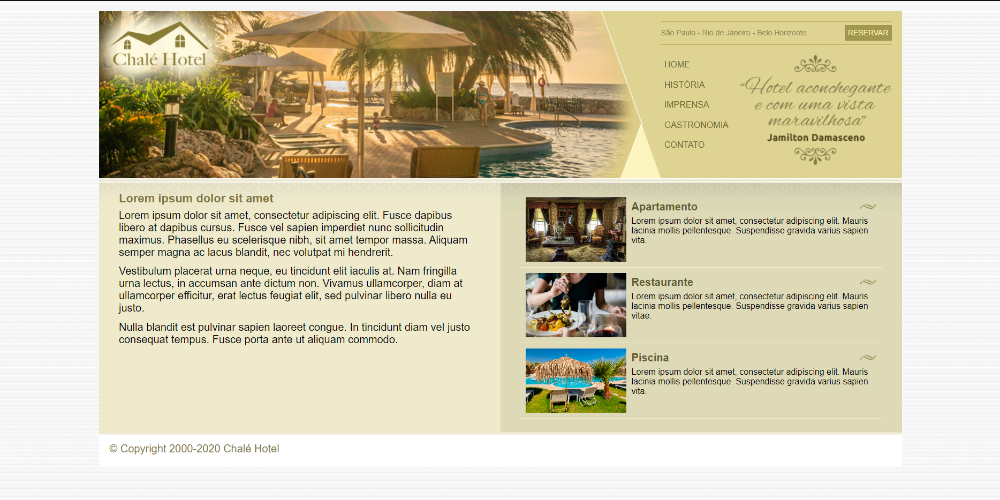

Projeto Udemy Desenvolvimento Web

Alguns ensinamentos de HTML e CSS, alguns recursos para estilizar e deixar o site mais profissional.

Olá eu sou o Mateus, repositório no intuito de mostrar meu progresso e nas aulas da Udemy e explicar um pou sobres as tecnologias técnicas que estou aprendendo.

#1 Uma das partes importantes ensinadas na construção desse site Chalé hotel foi a parte da construção do menu e logo que contem uma imagem longa feita para ser sobreposta pelo menu, formando uma interação bem interessante entre as duas ja que usamos z-index para controlar a ordem de sobreposição das duas areas e toda a sua formação com floats e position: absolute.

#2 Layout liquido usando a % como forma de medida e usando imagens criadas para aula para dividir os dois conteúdos, importante lembrar que usamos a técnica da coluna falsa repetindo uma imagem grande na vertical para fazer esse e feito de coluna e dividir os dois conteúdos e para dividir o topo interação com a repetição da imagem na horizontal, repeat-y (vertical) repeat-x(horizontal).

###### Projeto Finalizado ######

###### Exemplificando o efeito que foi explicado ######

